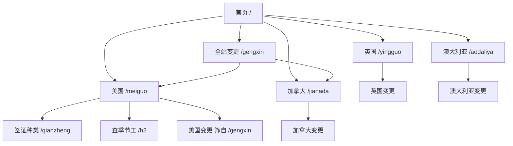

# 各国签证政策站：信息架构与交互方案

主线：**对照官网，看某国现在怎么规定，以及规定何时改了。** 美国签证种类和 H-2 查询保留，但降级为「美国」下的工具，不再和全站主线抢首页。

继续用静态 HTML + JSON + Python 生成页，改 JSON 即可记变更，不引入后台。

第一批国家：美国做完整页；加拿大、英国、澳大利亚先做空壳（现有政策待补，变更可先记）。

## 现站为什么乱

- 首页 H1 写「各国签证政策」，正文却是 17 张美国签证卡 + 目的筛选，承诺和内容对不上。
- 顶栏把「签证种类 / 查季节工 / 政策更新」并列，H-2 工具和全站主产品同级。
- 新旧两套导航：新页是「签证政策」，`gangwei.html` / `h2a.html` / `h2b.html` 仍是「H-2 查阅」。
- 变更已有数据 `zhengce-rizhi.json`，但没有国家页可挂，也无法按国家筛。
- 「看清楚 →」只跳到 `qianzheng.html` 锚点，用户不知道下一步是读规则、看变更，还是去查岗。

## 信息架构

以**国家**为一级对象。每个国家两块内容：**现有政策**（规则快照）和 **变更**（追加的条目）。



建议路由（旧地址保留，避免已收录链接失效）：

- `/` 首页：国家入口 + 全站最新变更
- `/gengxin` 变更时间线，可按国家筛
- `/meiguo` 美国国家页（现有政策摘要 + 该国变更 + 工具入口）
- `/qianzheng`、`/h2` 保持现址，面包屑改为「签证政策 / 美国 / …」
- `/jianada`、`/yingguo`、`/aodaliya` 空壳国家页：现有政策写「待补」，变更区可先有条目
- `/gangwei`、`/h2a`、`/h2b` 只做 SEO 列表，导航并入新顶栏，不再自成一套站点

顶栏只留两项主功能：**国家**、**政策更新**。品牌回首页。「查季节工」只出现在美国页和签证说明里的 H-2 卡片上。

## 各页交互

### 首页

不再铺签证卡，也不再问「你想去干什么」。

1. 一句定位：对照官网，看各国现有政策和官方变更。不收费，不代办。
2. 四个国家卡：美国标「可查现有政策」；加/英/澳标「现有政策待补，变更可先看」。每张卡写一句对中国护照最要紧的话（美国已有：没有免签、工作签几乎都要对方递）。
3. 「最近记下的变更」：从 `zhengce-rizhi.json` 取最近 5–8 条，每条固定显示 **国家 · 生效日 · 标题**，点标题进变更详情位置，点国家进国家页。
4. 页脚官方入口与免责声明保持现有口径。

### 国家页（美国完整，其余空壳同一模板）

页面上方用两个锚点切换，而不是再做一套筛选：

- **现有政策**：美国复用现在首页那套目的芯片（玩玩 / 读书 / 干几个月 / 专业工作），筛完只留「能碰到的」；「办不了」「不是这条路」默认收进一条「先别走这些」折叠，避免和主路径抢视线。加/英/澳这里是待补说明 + 之后可填的 3–6 条路径卡。
- **最近变更**：只列该国条目。没有条目时写「还没有记下的改动」。
- **工具**（仅美国）：「看签证种类说明」「查公开季节工岗位」两颗明确按钮，替代现在含糊的「看清楚 →」。

每张政策卡的下一步要写具体动作，例如「看 B-1/B-2 规则」「去查 H-2 岗位」，不要统一「看清楚」。

国家页顶上固定一行：**本页最后核对 YYYY-MM-DD**。有即将生效的变更时，在相关卡片上挂一句「YYYY-MM-DD 起规则将变」，点进该条变更。

### 变更页 `/gengxin`

现有按「记下日期」分组保留，补三件事：

- 国家芯片：全部 / 美国 / 加拿大 / 英国 / 澳大利亚（筛完更新列表，写入 `?country=us`，可分享）
- 每条卡片信息顺序固定：标题 → 国家 → 官网公布日 / 生效日 → 改了什么 → 官网链接 → 若影响站内某页则给「影响到：F-1 说明」
- 不把「对站点」写成给读者的主文；那是校对备忘，可放在卡片底部小字，或只留在 JSON 里、页面不渲染

### 美国签证说明 `/qianzheng`

结构可继续一页到底，但目录按国家页同一分组（能碰到的 / 办不了 / 不是这条路）。每条签证块顶部若有关联变更（`site_pages` 对上），先出一条变更条，再写「用来干什么 / 谁递件 / 中国护照 / 待多久 / 常见坑」。H-2A/H-2B 块保留「查公开岗位」出口。

### H-2 `/h2`

交互骨架可留：工种 → 出发时间 → 地区 → 技能 → 结果。改两处认知：

- 默认「两个月后」不要看起来像「随便看看」；在结果上方写清「已按：两个月后可走 · 未限工种 · 未限地区」，并给「清除条件」
- 地图默认是「点岗位看位置」；点州才变成筛选。现在两种用法叠在一起，用户分不清
- 「换一批」改成「再看 8 条」，避免像抽奖

## 自己记变更的数据方案

继续「改 JSON → 跑脚本 → 出 HTML」，与现有 `build_gengxin.py` 同一套路。

新增 `countries.json`（放仓库根目录，和日志并列）：

```json
{
  "countries": [
    {"id": "us", "slug": "meiguo", "name": "美国", "status": "ready", "checked": "2026-08-17", "blurb": "中国护照没有免签。工作签几乎都要对方先递。"},
    {"id": "ca", "slug": "jianada", "name": "加拿大", "status": "placeholder", "checked": null, "blurb": "现有政策待补。"},
    {"id": "uk", "slug": "yingguo", "name": "英国", "status": "placeholder", "checked": null, "blurb": "现有政策待补。"},
    {"id": "au", "slug": "aodaliya", "name": "澳大利亚", "status": "placeholder", "checked": null, "blurb": "现有政策待补。"}
  ]
}
```

`zhengce-rizhi.json` 现有字段够用，只把 `country` 改成稳定 id（`us` / `ca` / `uk` / `au`），展示名从 `countries.json` 查。追加一条时最少填：

- `logged` 记下的日期
- `country` 国家 id
- `title` 一句话
- `what` 改了什么
- `source` 官网链接
- 可选：`announced`、`effective`、`site_pages`（例如 `qianzheng#f1`）、`affects`（校对备注）

日常操作只有两步：在 `zhengce-rizhi.json` 数组头部插入一条，跑 `python3 build_gengxin.py`。首页「最近变更」和国家页「该国变更」都从同一份日志生成，避免三处手写。

加新国家：在 `countries.json` 加一行 + 复制空壳国家页；不必先写完整政策。补现有政策：只改该国页正文，变更日志不用动。

## 实现时改哪些文件

- 重写 `index.html` 为国家入口
- 新增 `meiguo.html` / `jianada.html` / `yingguo.html` / `aodaliya.html`（或由脚本从模板生成）
- 扩展 `build_gengxin.py`：国家筛选、统一顶栏、首页/国家页变更片段
- 统一 `qianzheng.html`、`h2.html` 顶栏与面包屑
- `sitemap.xml` 补四个国家页
- `build_seo.py` 的旧 H-2 导航改成与全站一致

视觉沿用现有纸色底、绿链、警示条，不换设计系统。
